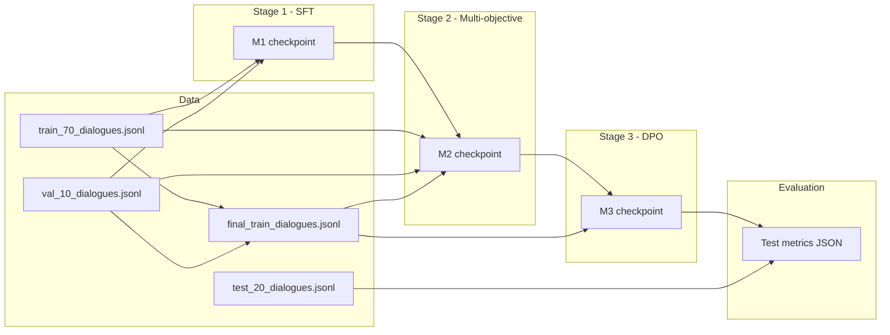

# Legal POSCO — 3-Stage Training Pipeline

**Student onboarding guide.** Read this document top to bottom before running anything. It explains what the project does, how the code is organized, and the exact commands to train and evaluate models.

**Repository:** [github.com/harshalDharpure/Legal_posco-3-stages](https://github.com/harshalDharpure/Legal_posco-3-stages)

---

## Table of contents

1. [What this project does](#1-what-this-project-does)
2. [High-level pipeline flow](#2-high-level-pipeline-flow)
3. [Repository layout](#3-repository-layout)
4. [Environment setup](#4-environment-setup)
5. [Dataset guide](#5-dataset-guide)
6. [Experiment rules (read carefully)](#6-experiment-rules-read-carefully)
7. [Step-by-step: run everything](#7-step-by-step-run-everything)
8. [Run stages individually](#8-run-stages-individually)
9. [Evaluation on the test set](#9-evaluation-on-the-test-set)
10. [Where outputs are saved](#10-where-outputs-are-saved)
11. [Multi-seed runs and ablations](#11-multi-seed-runs-and-ablations)
12. [Troubleshooting](#12-troubleshooting)
13. [Further reading](#13-further-reading)
14. [Quick checklist for a new student](#14-quick-checklist-for-a-new-student)

---

## 1. What this project does

This project trains a **legal dialogue assistant** for Indian child-protection law (POCSO, IPC, CrPC, etc.) in **Hindi, English, and code-mixed (Hinglish)** text.

Training happens in **three sequential stages**:

| Stage | Name | Model | Goal |
|-------|------|-------|------|
| **1** | SFT (Supervised Fine-Tuning) | **M1** | Teach the base LLM to follow the legal dialogue format and produce grounded answers. |
| **2** | Multi-objective training | **M2** | Improve factual consistency (NLI entailment) and representation quality (triplet loss with hard negatives). |
| **3** | DPO (Direct Preference Optimization) | **M3** | Prefer correct answers over dynamically generated wrong answers. |

**Base model:** `meta-llama/Meta-Llama-3.1-8B-Instruct` (requires Hugging Face access).

---

## 2. High-level pipeline flow



**During development (tuning):** use **train** + **val** only.  
**After hyperparameters are fixed:** merge train+val → `final_train_dialogues.jsonl`, retrain M2/M3 on merged data, then evaluate **once** on **test**.

---

## 3. Repository layout

Always run commands from the **repository root** (the folder that contains `datasets/` and `q1_3stage_pipeline/`).

```
Legal_posco-3-stages/
├── README.md                          ← you are here
├── PROJECT_DATASET_DETAILS.md         ← dataset schema & statistics
├── datasets/
│   ├── dialogue_splits_70_10_20/      ← train / val / test JSONL (in git)
│   ├── merged/                        ← auto-built train+val (gitignored)
│   ├── scripts/                       ← split recreation script
│   └── README.md
└── q1_3stage_pipeline/
    ├── stage1/                        ← Stage 1 SFT code
    ├── stage2/                        ← Stage 2 multi-objective code
    ├── stage3/                        ← Stage 3 DPO code
    ├── evaluation/                    ← metrics, generation, test eval
    ├── configs/pipeline_default.yaml  ← default hyperparameters
    ├── utils/                         ← prompt format, dataset builder
    ├── ablation/                      ← Stage 2 ablation runner
    ├── scripts/                       ← helper shell scripts
    ├── run_full_pipeline.py           ← one-command orchestrator
    ├── run_full_pipeline.sh           ← background wrapper
    ├── requirements.txt
    └── outputs/                       ← checkpoints & logs (gitignored, created locally)
        ├── checkpoints/stage1/
        ├── checkpoints/stage2/
        ├── checkpoints/stage3/
        ├── eval_cache/
        └── pipeline_runs/
```

---

## 4. Environment setup

### 4.1 Clone the repository

```bash
git clone https://github.com/harshalDharpure/Legal_posco-3-stages.git
cd Legal_posco-3-stages
```

### 4.2 Python environment

You need **Python 3.10+**, **CUDA GPU** (recommended ≥ 24 GB VRAM for full fine-tuning; 4-bit mode helps on smaller GPUs), and **PyTorch** with CUDA.

```bash
python3 -m venv .venv
source .venv/bin/activate

# Install PyTorch for your CUDA version first (see https://pytorch.org)
# Example:
# pip install torch torchvision torchaudio --index-url https://download.pytorch.org/whl/cu124

pip install -r q1_3stage_pipeline/requirements.txt
pip install transformers accelerate bitsandbytes pyyaml
```

### 4.3 Hugging Face access

1. Create a Hugging Face account and **request access** to [Meta-Llama-3.1-8B-Instruct](https://huggingface.co/meta-llama/Meta-Llama-3.1-8B-Instruct).
2. Create an access token at [huggingface.co/settings/tokens](https://huggingface.co/settings/tokens).

```bash
export HF_TOKEN="hf_your_token_here"
export HUGGINGFACE_HUB_TOKEN="$HF_TOKEN"
```

Verify:

```bash
python3 -c "import os; print('Token set:', bool(os.environ.get('HF_TOKEN')))"
```

Or login once (stores token in `~/.cache/huggingface/`):

```bash
huggingface-cli login
```

### 4.4 Pick a GPU

```bash
nvidia-smi   # find a free GPU index, e.g. 0 or 1
export CUDA_VISIBLE_DEVICES=0
```

### 4.5 Smoke test (no training)

```bash
cd Legal_posco-3-stages   # repo root
export PYTHONPATH=.

python3 -c "
from q1_3stage_pipeline.utils import DatasetBuilder, load_jsonl
rows = load_jsonl('datasets/dialogue_splits_70_10_20/train_70_dialogues.jsonl')
pairs = DatasetBuilder(rows).build_sft()
print('OK — dialogues:', len(rows), 'SFT pairs:', len(pairs))
"
```

If this prints `OK`, your environment and data paths are correct.

---

## 5. Dataset guide

### 5.1 Files you will use

| File | Dialogues | Purpose |
|------|-----------|---------|
| `datasets/dialogue_splits_70_10_20/train_70_dialogues.jsonl` | 840 | Training during tuning |
| `datasets/dialogue_splits_70_10_20/val_10_dialogues.jsonl` | 120 | Validation / hyperparameter tuning |
| `datasets/dialogue_splits_70_10_20/test_20_dialogues.jsonl` | 240 | **Final test only** (do not peek during tuning) |
| `datasets/merged/final_train_dialogues.jsonl` | 960 | Auto-built train+val for final M2/M3 retrain |

### 5.2 Data format

Each line in a JSONL file is **one multi-turn dialogue**:

```json
{
  "dialogue_id": "...",
  "language": "hindi",
  "turns": [
    {"role": "user", "content": "..."},
    {"role": "assistant", "content": "...", "statutes_cited": ["POCSO Section 4"]}
  ]
}
```

The code **flattens** dialogues into `(prompt, output)` pairs in memory using a rolling window — you do **not** need separate pair files.

### 5.3 Prompt template (must stay consistent)

All stages use this format:

```text
[USER]: {user message and prior context}
[ASSISTANT]:
```

The model is trained to generate only the text **after** `[ASSISTANT]:`.

---

## 6. Experiment rules (read carefully)

1. **Never tune on the test set.** Use val for choosing hyperparameters (learning rate, DPO β, etc.).
2. **Train Stage 1 on train only** (val is for evaluation during SFT).
3. **After tuning is frozen:**
   - Build `datasets/merged/final_train_dialogues.jsonl` (train + val).
   - Retrain **M2** and **M3** on the merged file.
   - Run **one** final evaluation on **test**.
4. Report results with **3 random seeds** (e.g. 42, 43, 44) and report mean ± std.
5. Checkpoints are **not in git** — back them up with `rsync` if you move servers.

---

## 7. Step-by-step: run everything

This is the **recommended path** for a new student: one command runs Stage 1 → Stage 2 → Stage 3.

### 7.1 Full pipeline (foreground)

From repo root:

```bash
export CUDA_VISIBLE_DEVICES=0
export HF_TOKEN="your_token"
export HUGGINGFACE_HUB_TOKEN="$HF_TOKEN"

# Allow downloading models on first run (remove offline flags)
HF_HUB_OFFLINE=0 TRANSFORMERS_OFFLINE=0 \
python3 q1_3stage_pipeline/run_full_pipeline.py \
  --config q1_3stage_pipeline/configs/pipeline_default.yaml \
  --seed 43 \
  --gpu 0
```

**What this does:**
- Creates `datasets/merged/final_train_dialogues.jsonl` if missing.
- Runs Stage 1 → saves `q1_3stage_pipeline/outputs/checkpoints/stage1/M1_seed43_qlora/final`
- Runs Stage 2 on merged train+val → saves `.../stage2/M2_fromM1_seed43_full_finaltrain/final`
- Runs Stage 3 DPO → saves `.../stage3/M3_fromM2_seed43_beta0.1/final`

### 7.2 Full pipeline (background)

```bash
nohup bash q1_3stage_pipeline/run_full_pipeline.sh --gpu 0 --seed 43 \
  > q1_3stage_pipeline/outputs/pipeline_runs/my_run.log 2>&1 &

tail -f q1_3stage_pipeline/outputs/pipeline_runs/my_run.log
```

To download models on first run:

```bash
HF_HUB_OFFLINE=0 TRANSFORMERS_OFFLINE=0 \
  nohup bash q1_3stage_pipeline/run_full_pipeline.sh --gpu 0 --seed 43 &
```

### 7.3 Resume Stage 2 if it crashed

```bash
python3 q1_3stage_pipeline/run_full_pipeline.py \
  --seed 43 --gpu 0 \
  --skip-stage1 --skip-stage3 \
  --resume-stage2
```

---

## 8. Run stages individually

Use these when debugging one stage or when a previous stage checkpoint already exists.

Set paths once:

```bash
export REPO_ROOT="$(pwd)"   # run from repo root
export SEED=43
export TRAIN="$REPO_ROOT/datasets/dialogue_splits_70_10_20/train_70_dialogues.jsonl"
export VAL="$REPO_ROOT/datasets/dialogue_splits_70_10_20/val_10_dialogues.jsonl"
export CONFIG="$REPO_ROOT/q1_3stage_pipeline/configs/pipeline_default.yaml"
```

### 8.1 Stage 1 — SFT (M1)

```bash
python3 q1_3stage_pipeline/stage1/train.py \
  --config "$CONFIG" \
  --train-jsonl "$TRAIN" \
  --val-jsonl "$VAL" \
  --output-dir "q1_3stage_pipeline/outputs/checkpoints/stage1/M1_seed${SEED}" \
  --seed "$SEED"
```

**Output:** `q1_3stage_pipeline/outputs/checkpoints/stage1/M1_seed43/final/`

**If GPU memory is low:** add `--load-in-4bit` or `--use-qlora` (see `python3 q1_3stage_pipeline/stage1/train.py --help`).

### 8.2 Build merged train file (for final M2/M3)

```bash
cat "$TRAIN" "$VAL" > datasets/merged/final_train_dialogues.jsonl
```

Or let `run_full_pipeline.py` create it automatically.

### 8.3 Stage 2 — Multi-objective (M2)

Stage 2 loss: **L = L_gen + λ₁·L_entail + λ₂·L_triplet**

```bash
python3 q1_3stage_pipeline/stage2/train.py \
  --config "$CONFIG" \
  --init-from m1 \
  --m1-path "q1_3stage_pipeline/outputs/checkpoints/stage1/M1_seed${SEED}/final" \
  --ablation full \
  --train-jsonl "datasets/merged/final_train_dialogues.jsonl" \
  --val-jsonl "$VAL" \
  --output-dir "q1_3stage_pipeline/outputs/checkpoints/stage2/M2_fromM1_seed${SEED}" \
  --eval-every 200 \
  --seed "$SEED" \
  --load-in-4bit \
  --nli-on-cpu
```

**Output:** `.../M2_fromM1_seed43/final/` and `.../best/` (use `best/` for Stage 3 if available).

**Resume after OOM/crash:**

```bash
# add --resume to the same command above
```

### 8.4 Stage 3 — DPO (M3)

Stage 3 mines preferences (chosen = gold, rejected = hard negatives), then runs DPO with **M2 as the frozen reference model**.

```bash
python3 q1_3stage_pipeline/stage3/train.py \
  --m2-path "q1_3stage_pipeline/outputs/checkpoints/stage2/M2_fromM1_seed${SEED}/final" \
  --train-jsonl "datasets/merged/final_train_dialogues.jsonl" \
  --output-dir "q1_3stage_pipeline/outputs/checkpoints/stage3/M3_beta0.1_seed${SEED}" \
  --beta 0.1 \
  --seed "$SEED" \
  --load-in-4bit \
  --epochs 1.0 \
  --lr 5e-6 \
  --batch-size 1 \
  --grad-accum 8
```

**Note:** Stage 3 has two phases in the log:
1. **Mining preferences** — loops over training pairs (slow, no weight updates).
2. **DPO training** — actual optimization.

**β sweep (pick best β on validation, then retrain on merged data):**

```bash
for beta in 0.1 0.5 1.0; do
  python3 q1_3stage_pipeline/stage3/train.py \
    --m2-path "q1_3stage_pipeline/outputs/checkpoints/stage2/M2_fromM1_seed${SEED}/final" \
    --train-jsonl "datasets/merged/final_train_dialogues.jsonl" \
    --output-dir "q1_3stage_pipeline/outputs/checkpoints/stage3/M3_beta${beta}_seed${SEED}" \
    --beta "$beta" \
    --seed "$SEED" \
    --load-in-4bit
done
```

---

## 9. Evaluation on the test set

**Only run this after training is complete and hyperparameters are fixed.**

### 9.1 All-in-one script (Stage 3 + test eval)

When M1 and M2 already exist:

```bash
export CUDA_VISIBLE_DEVICES=0
export M2_PATH="q1_3stage_pipeline/outputs/checkpoints/stage2/M2_fromM1_seed43/final"
export MIN_NLI=0.70   # optional quality gate (script exits 2 if below)

bash q1_3stage_pipeline/scripts/run_stage3_and_eval_test.sh
```

Skip DPO if M3 already exists:

```bash
export SKIP_DPO=1
export M3_OUT="q1_3stage_pipeline/outputs/checkpoints/stage3/M3_beta0.1_seed43"
bash q1_3stage_pipeline/scripts/run_stage3_and_eval_test.sh
```

### 9.2 Manual evaluation steps

```bash
# 1) Flatten test dialogues to (prompt, reference) pairs
python3 q1_3stage_pipeline/evaluation/prepare_test_pairs.py \
  --dialogue-jsonl datasets/dialogue_splits_70_10_20/test_20_dialogues.jsonl \
  --out-jsonl q1_3stage_pipeline/outputs/eval_cache/test_pairs_flat.jsonl

# 2) Generate model predictions (greedy decode)
python3 q1_3stage_pipeline/evaluation/generate_preds.py \
  --model-path q1_3stage_pipeline/outputs/checkpoints/stage3/M3_beta0.1_seed43/final \
  --pairs-jsonl q1_3stage_pipeline/outputs/eval_cache/test_pairs_flat.jsonl \
  --out-jsonl q1_3stage_pipeline/outputs/eval_cache/test_preds.jsonl \
  --load-in-4bit

# 3) Compute metrics
python3 q1_3stage_pipeline/evaluation/run_eval.py \
  --test-jsonl q1_3stage_pipeline/outputs/eval_cache/test_pairs_flat.jsonl \
  --pred-jsonl q1_3stage_pipeline/outputs/eval_cache/test_preds.jsonl \
  --metrics-json q1_3stage_pipeline/outputs/eval_cache/test_metrics.json
```

**Metrics reported:** ROUGE, BLEU, METEOR, NLI entailment score, statute-citation overlap, safety/refusal proxies.

### 9.3 Compare M1 vs M2 vs M3 on test

```bash
bash q1_3stage_pipeline/evaluation/run_stage1_stage2_test_eval.sh
```

Edit paths inside that script to point to your checkpoint folders.

---

## 10. Where outputs are saved

| Artifact | Typical path |
|----------|----------------|
| Stage 1 checkpoint | `q1_3stage_pipeline/outputs/checkpoints/stage1/M1_seed{SEED}/final/` |
| Stage 2 checkpoint | `q1_3stage_pipeline/outputs/checkpoints/stage2/M2_fromM1_seed{SEED}/final/` |
| Stage 2 best (for DPO) | `.../best/` |
| Stage 3 checkpoint | `q1_3stage_pipeline/outputs/checkpoints/stage3/M3_beta{BETA}_seed{SEED}/final/` |
| Stage 3 preference cache | `.../preferences.jsonl` |
| Pipeline logs | `q1_3stage_pipeline/outputs/pipeline_runs/` |
| Test metrics | `q1_3stage_pipeline/outputs/eval_cache/test_metrics.json` |
| Run manifest | `q1_3stage_pipeline/outputs/checkpoints/pipeline_last_run.json` |

---

## 11. Multi-seed runs and ablations

### 11.1 Three seeds (required for reporting)

```bash
for seed in 42 43 44; do
  python3 q1_3stage_pipeline/run_full_pipeline.py --seed "$seed" --gpu 0
done
```

### 11.2 Stage 2 ablations

Runs `gen_only`, `gen_entail`, `gen_triplet`, and `full`:

```bash
python3 q1_3stage_pipeline/ablation/run_stage2_ablations.py \
  --config q1_3stage_pipeline/configs/pipeline_default.yaml \
  --train-jsonl datasets/dialogue_splits_70_10_20/train_70_dialogues.jsonl \
  --val-jsonl datasets/dialogue_splits_70_10_20/val_10_dialogues.jsonl \
  --m1-path q1_3stage_pipeline/outputs/checkpoints/stage1/M1_seed43/final \
  --out-root q1_3stage_pipeline/outputs/checkpoints/stage2_ablations
```

---

## 12. Troubleshooting

| Problem | What to try |
|---------|-------------|
| **CUDA OOM** | Add `--load-in-4bit` to stage2/stage3; use `--nli-on-cpu` for stage2; pick a freer GPU with `nvidia-smi`. |
| **Cannot download Llama** | Set `HF_TOKEN`, request model access on Hugging Face, run with `HF_HUB_OFFLINE=0 TRANSFORMERS_OFFLINE=0`. |
| **Stage 3 very slow at start** | Normal — it is **mining preferences** over all train pairs before DPO training begins. Watch the log for `mining preferences: x/N`. |
| **DPOConfig TypeError** | Already handled in code (falls back if `max_prompt_length` unsupported). Update `trl` if other errors appear. |
| **Module not found** | Run from repo root; set `export PYTHONPATH=.`. |
| **Empty outputs folder** | Expected on fresh clone — checkpoints are gitignored and created when you train. |

---

## 13. Further reading

| Document | Contents |
|----------|----------|
| `PROJECT_DATASET_DETAILS.md` | Dataset schema, counts, evaluation strategy |
| `datasets/README.md` | Dataset folder layout |
| `q1_3stage_pipeline/REPORT_3STAGE_PIPELINE.md` | Technical report / methodology |
| `q1_3stage_pipeline/configs/pipeline_default.yaml` | Default hyperparameters |
| `RESEARCH_HANDOFF.md` | Server migration and rsync notes |

---

## 14. Quick checklist for a new student

- [ ] Clone repo and `cd Legal_posco-3-stages`
- [ ] Create venv, install `requirements.txt` + PyTorch + transformers
- [ ] Set `HF_TOKEN` and get Llama-3.1-8B access on Hugging Face
- [ ] Run dataset smoke test (Section 4.5)
- [ ] Choose GPU: `export CUDA_VISIBLE_DEVICES=0`
- [ ] Run full pipeline OR stages one-by-one (Sections 7–8)
- [ ] Wait for Stage 3 mining + training to finish
- [ ] Run test evaluation once (Section 9)
- [ ] Back up `q1_3stage_pipeline/outputs/` before leaving the server

**Questions?** Read `PROJECT_DATASET_DETAILS.md` first, then inspect the stage `train.py --help` for all CLI flags.
